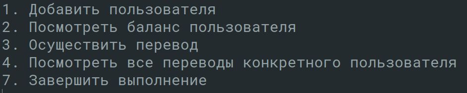
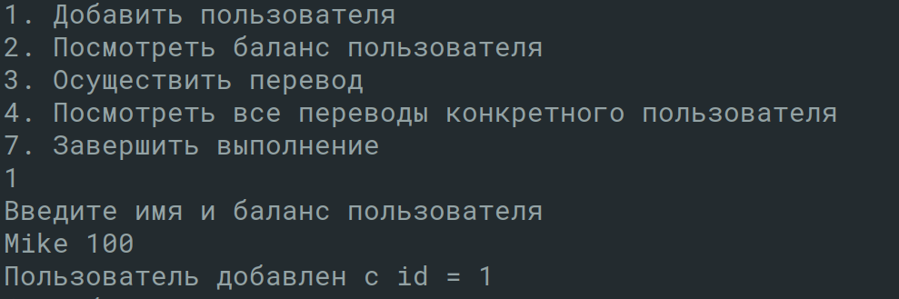
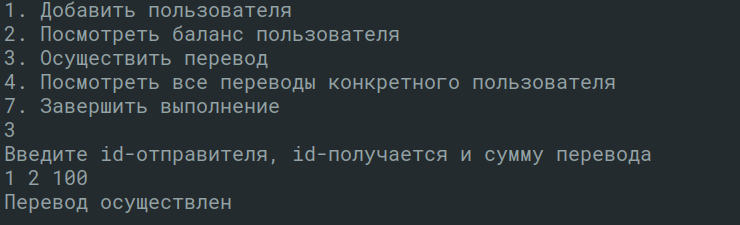
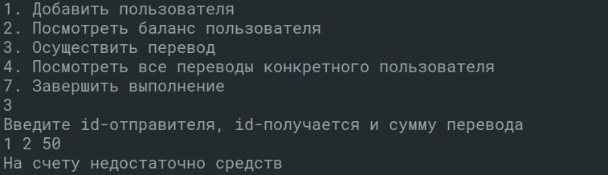
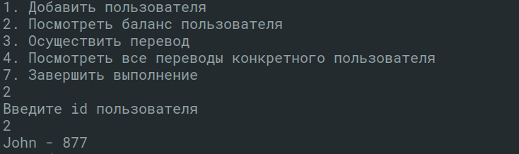
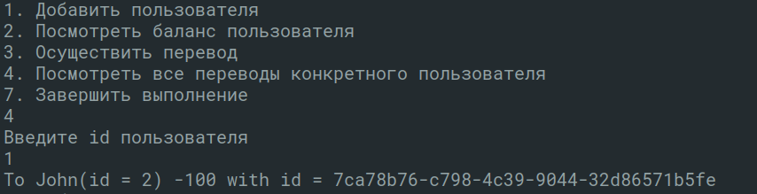
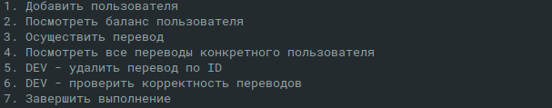
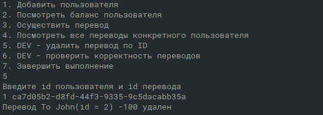
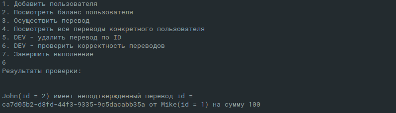

## Transactions 42 school's project

[Transactions](transactions.pdf) is an individual java project at [42](https://www.42.us.org/).

Disclaimer: *Reinventing the wheel is bad, 42 makes us do this just so we can have a deeper understanding of data structures and basic algorithms. At 42 we're not allowed to use some standard libraries on our projects.*

## Usage

*Production mode*

`java -jar PiscineJava.jar`

# Menu

# AddUser

# Transfer

# ShowBalance

# ShowTransactions

*Dev mode*

`java -jar PiscineJava.jar --profile=dev`

